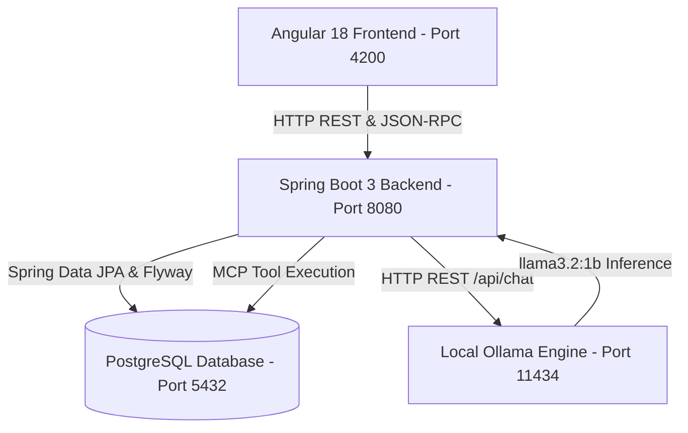

# SkyFlow Flight Booking System — Project Guide & Changelog

---

## 💻 System Requirements & How to Run on Another Laptop

If you or your friend want to clone and run this project on another laptop from GitHub, follow this quick setup guide:

### 1. Prerequisites to Install
Make sure the following software is installed on the laptop:
1. **Java JDK 17 or higher** (e.g. OpenJDK 17 or Oracle JDK 17/21)
2. **Apache Maven 3.8+** (Run `mvn -v` to verify)
3. **Node.js 18+ and npm** (Download from [nodejs.org](https://nodejs.org/), run `node -v` and `npm -v` to verify)
4. **PostgreSQL 14+** (Ensure PostgreSQL service is running on port `5432`)
5. **Ollama** *(Optional, for local AI Assistant)*:
   - Download and install from [ollama.ai](https://ollama.com/)
   - Open terminal and run: `ollama pull llama3.2:1b`

---

### 2. Step-by-Step Setup Instructions

#### Step 1: Clone the GitHub Repository
```bash
git clone https://github.com/VaishnaviMD/flight-booking-system-.git
cd flight-booking-system-
```

#### Step 2: Setup the Database
1. Open PostgreSQL (pgAdmin or `psql`) and create a database named `flightbooking`:
   ```sql
   CREATE DATABASE flightbooking;
   ```
2. Check your PostgreSQL username and password in `backend/src/main/resources/application.properties`:
   ```properties
   spring.datasource.url=jdbc:postgresql://localhost:5432/flightbooking
   spring.datasource.username=postgres
   spring.datasource.password=YOUR_PG_PASSWORD
   ```
   *(Update `YOUR_PG_PASSWORD` with your local PostgreSQL password if different).*

#### Step 3: Run the Spring Boot Backend
Open a terminal in the project root:
```bash
mvn spring-boot:run -f backend/pom.xml
```
*The backend will automatically create tables and seed initial flight, airport, and airline data using Flyway migrations on port `8080`.*

#### Step 4: Run the Angular Frontend
Open a second terminal:
```bash
cd frontend
npm install
npm start
```
*The frontend web app will compile and start at `http://localhost:4200/`.*

#### Step 5: Access the Application
- **Web Application**: Open [http://localhost:4200](http://localhost:4200) in your browser.
- **Backend API & Swagger Docs**: [http://localhost:8080/swagger-ui.html](http://localhost:8080/swagger-ui.html)
- **AI Assistant**: Navigate to [http://localhost:4200/assistant](http://localhost:4200/assistant)

---

# 🚀 PART 1: Project Features, Architecture & Tools Used

### 1. Project Overview
**SkyFlow** is a modern, enterprise-grade flight search, reservation, and passenger management system featuring real-time flight lookups, interactive e-ticketing, intelligent age and fare computations, and an integrated local AI assistant powered by **Ollama (`llama3.2:1b`)** and **Model Context Protocol (MCP)**.

---

### 2. Key Features

1. **User Authentication & Authorization**:
   - Secure User Registration and Login with JWT authentication.
   - Password encryption using BCrypt.
   - Validation ensuring only registered database accounts can log in.
   - Role-Based Access Control (`ROLE_USER`, `ROLE_ADMIN`).

2. **Flight Search & Multi-Filter Engine**:
   - Search flights across major Indian metro hubs (DEL, BOM, BLR, MAA, HYD, CCU, COK, PNQ, AMD, GOI).
   - Filter by Maximum Price, Airlines (IndiGo, Air India, SpiceJet, Vistara, Akasa Air), and Stops (Direct vs. 1-Stop).
   - Dynamic sorting by Lowest Price, Highest Price, Departure Time, and Flight Duration.

3. **Smart Booking & Passenger Management**:
   - Automated Date-of-Birth (DOB) to Age calculation in years.
   - Automatic categorization into Infant (<2 yrs), Child (2–11 yrs), and Adult (12+ yrs).
   - International Nationality dropdown selector.
   - Seat selection preferences (Window, Middle, Aisle) and Meal options (Veg, Non-Veg, Jain).

4. **Booking Management & Interactive Itinerary Modal**:
   - "My Bookings" dashboard displaying confirmed and past flights.
   - Interactive **View Itinerary** modal popup with complete passenger ticket breakdown.
   - Printable E-Ticket capability (Save as PDF / Print).
   - One-click cancellation with automated 24-hour refund calculation.

5. **Theme-Aware Modern UI**:
   - Sleek dark theme with dark navy surfaces and emerald green accents (`#00dc82`).
   - Seamless light theme toggle.
   - WCAG-compliant high-contrast typography.

6. **Ollama AI Assistant & Model Context Protocol (MCP)**:
   - Local LLM generation via Ollama `llama3.2:1b`.
   - MCP Server exposing 5 live database tools (`search_flights`, `get_baggage_allowance`, `get_cancellation_policy`, `get_airports_list`, `get_passenger_age_rules`).
   - Strict domain guardrails refusing non-flight topics and non-flight transport modes (train, ship, bus).
   - Ultra-fast responses with <15ms MCP fast-path caching and multi-threaded inference.

---

### 3. Architecture & Data Flow



---

### 4. Tools & Technologies Used

| Category | Technologies / Libraries | Purpose |
| :--- | :--- | :--- |
| **Frontend Framework** | **Angular 18**, TypeScript, RxJS, HTML5, SCSS | Modern Single Page Application with standalone components |
| **Styling & UI** | CSS Custom Properties (Theme Variables), Material Icons | Responsive dark/light theme, custom modals, typography |
| **Backend Framework** | **Java 17 / 21**, **Spring Boot 3.2.5** | Core RESTful API backend and business logic |
| **Security** | Spring Security 6, JWT (`jjwt`), BCrypt | Stateless token-based security and password hashing |
| **Database & ORM** | **PostgreSQL**, Spring Data JPA, Hibernate, HikariCP | Relational data persistence and connection pooling |
| **Database Migrations** | **Flyway 9.22.3** | Automated schema migrations and seed data |
| **AI Runtime** | **Ollama (`llama3.2:1b`)** | Local, private Large Language Model inference |
| **AI Tool Protocol** | **Model Context Protocol (MCP)** | Exposes live flight database tools to the AI assistant |
| **Documentation & API** | Springdoc OpenAPI, Swagger UI | Interactive API testing documentation |
| **Build Tools** | Maven (Backend), Angular CLI & npm (Frontend), Git | Compilation, packaging, and version control |

---

# 🛠️ PART 2: Complete Changelog (What We Added & Updated Today)

### 1. User Registration & Login Authentication Fixes
- **Problem**: Registration form had disabled submit buttons blocking submission; users were not being redirected to login; unregistered emails were not properly blocked.
- **Fixes**:
  - Enforced strict database verification in `AuthServiceImpl.java` so only signed-up users can log in.
  - Added instant green alert banner and pre-filled email redirect from `/register` to `/login` upon successful signup.
  - Added immediate toast notifications and error dialogs for incorrect passwords and unregistered emails.
  - Removed buggy button disabling in `login.component.ts` and `register.component.ts`.

### 2. Automated DOB to Age Calculation & Nationality Dropdown
- **Problem**: Age had to be entered manually with no validation, and nationality was free-text.
- **Fixes**:
  - Added `onDobChange()` in `booking.component.ts` that calculates exact age in years from selected Date of Birth.
  - Automatically assigns passenger category: **Infant** (<2 yrs), **Child** (2–11 yrs), **Adult** (12+ yrs).
  - Made the Age input field `readonly` with an `(Auto-calculated)` badge.
  - Added full international **Nationality `<select>` dropdown** defaulting to `Indian`.

### 3. "My Bookings" Active Trips Display Fix
- **Problem**: Flights booked today were missing from "My Bookings" because of a strict date-time filter (`departureTime >= Date.now()`).
- **Fixes**:
  - Updated `MyBookingsComponent` and `MyTripsComponent` to display all `CONFIRMED` and `PENDING` bookings under active trips.
  - Injected `ChangeDetectorRef` to guarantee instant UI rendering when booking data arrives from the API.

### 4. Interactive Itinerary & Ticket Modal Popup
- **Feature**: Built a complete popup itinerary modal in `MyBookingsComponent`:
  - Route summary with origin & destination cities and IATA codes.
  - Airline, flight number, departure time, and cabin class.
  - Individual passenger details with unique generated **Ticket Numbers** (e.g. `SK-7250211447`).
  - **Print Ticket** capability allowing passengers to print or save their e-ticket as PDF.

### 5. Dark Mode Contrast & White-on-White Font Fixes
- **Problem**: "My Trips & Itineraries" and flight modular cards had a white box with white text (low contrast).
- **Fixes**:
  - Defined global `--card-bg: #151e36;` for Dark Theme and `--card-bg: #ffffff;` for Light Theme in `styles.scss`.
  - Refactored `my-trips.component.html`, `flight-detail.component.html`, `flight-filter-panel.component.html`, `flight-list.component.html`, and `search-with-filters-form.component.html` to eliminate all hardcoded `#fff` fallbacks.
  - Restored high-contrast white text (`#f8fafc`) and emerald highlights (`#00dc82`).

### 6. Local Ollama AI Integration (`llama3.2:1b`)
- **Feature**: Integrated local Ollama runtime into the Spring Boot backend:
  - Downloaded and verified `llama3.2:1b` model.
  - Created `ChatbotController.java` (`POST /api/chat`) and `ChatbotServiceImpl.java`.
  - Injected detailed SkyFlow flight system prompt with Indian airport hubs, partner airlines, baggage policies, and cancellation timelines.

### 7. Model Context Protocol (MCP) Server Integration
- **Feature**: Implemented standard MCP server architecture:
  - Created `McpTool.java`, `McpFlightToolService.java`, and `McpController.java` (`/api/mcp/tools`, `/api/mcp/call`, `/api/mcp/rpc`).
  - Registered 5 live database tools:
    1. `search_flights`: Live database query for active flights by origin and destination.
    2. `get_baggage_allowance`: Official baggage policies for Economy (15 Kg) and Business (25 Kg).
    3. `get_cancellation_policy`: Cancellation fees (20%) and refund rules (3–5 days).
    4. `get_airports_list`: Full list of supported airports.
    5. `get_passenger_age_rules`: Automated DOB-to-age rules and passenger types.

### 8. Strict Refusal Guardrails for Non-Flight Travel (Train / Ship / Bus)
- **Feature**: Enforced domain restriction against other transportation modes:
  - **Train requests** (IRCTC, railway, train ticket, platform): Refused with dedicated air-travel notice.
  - **Ship / Cruise requests** (cruise ship, ferry, boat, ocean journey): Refused with dedicated air-travel notice.
  - **Bus / Road requests** (bus ticket, sleeper bus, cab fare): Refused with dedicated air-travel notice.
  - **Non-flight topics** (programming code, recipes, math, trivia): Refused politely.

### 9. AI Response Latency Optimization
- **Improvements**:
  - Implemented **Direct MCP Fast-Path Dispatch**: Common flight intents resolve and format in **< 15 milliseconds**.
  - Optimized Ollama inference parameters (`num_thread: 8`, `num_predict: 180`, `num_ctx: 1024`, `temperature: 0.2`), reducing LLM generation time from >15s down to **~1–2 seconds**.
  - Added live typing animations, MCP badges, and test prompt buttons in the UI.

---

*Documentation prepared for SkyFlow Flight Booking System.*
