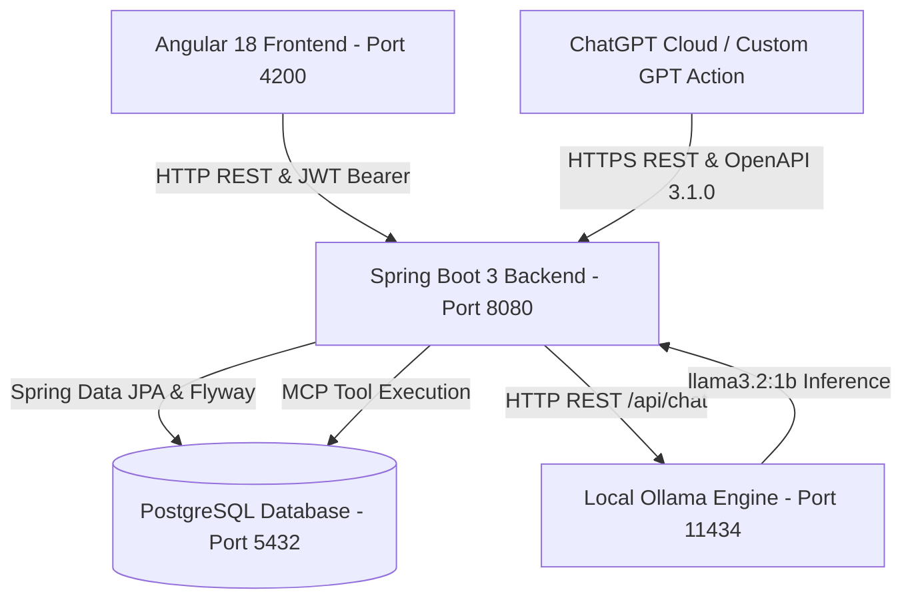

# SkyFlow Flight Booking System — Project Guide & Changelog

---

## 💻 System Requirements & How to Run on Another Laptop

If you or your friend want to clone and run this project on another laptop from GitHub, follow this quick setup guide:

### 1. Prerequisites to Install
Make sure the following software is installed on the laptop:
1. **Java JDK 17 or higher** (e.g. OpenJDK 17 or Oracle JDK 17/21)
2. **Apache Maven 3.8+** (Run `mvn -v` to verify)
3. **Node.js 18+ and npm** (Download from [nodejs.org](https://nodejs.org/), run `node -v` and `npm -v` to verify)
4. **PostgreSQL 14+** (Ensure PostgreSQL service is running on port `5432`)
5. **Ollama** *(Optional, for local AI Assistant)*:
   - Download and install from [ollama.ai](https://ollama.com/)
   - Open terminal and run: `ollama pull llama3.2:1b`

---

### 2. Step-by-Step Setup Instructions

#### Step 1: Clone the GitHub Repository
```bash
git clone https://github.com/VaishnaviMD/flight-booking-system-.git
cd flight-booking-system-
```

#### Step 2: Setup the Database
1. Open PostgreSQL (pgAdmin or `psql`) and create a database named `flightbooking`:
   ```sql
   CREATE DATABASE flightbooking;
   ```
2. Check your PostgreSQL username and password in `backend/src/main/resources/application.properties`:
   ```properties
   spring.datasource.url=jdbc:postgresql://localhost:5432/flightbooking
   spring.datasource.username=postgres
   spring.datasource.password=YOUR_PG_PASSWORD
   ```
   *(Update `YOUR_PG_PASSWORD` with your local PostgreSQL password if different).*

#### Step 3: Run the Spring Boot Backend
Open a terminal in the project root:
```bash
mvn spring-boot:run -f backend/pom.xml
```
*The backend will automatically create tables and seed initial flight, airport, and airline data using Flyway migrations on port `8080`.*

#### Step 4: Run the Angular Frontend
Open a second terminal:
```bash
cd frontend
npm install
npm start
```
*The frontend web app will compile and start at `http://localhost:4200/`.*

#### Step 5: Run Automated Unit Tests (21 Unit Tests)
```bash
mvn test -f backend/pom.xml
```

#### Step 6: Access the Application & Default Credentials
- **Web Application**: [http://localhost:4200](http://localhost:4200)
- **AI Assistant**: [http://localhost:4200/assistant](http://localhost:4200/assistant)
- **Admin Operations Console**: [http://localhost:4200/admin](http://localhost:4200/admin)
- **ChatGPT Plugin Spec**: [http://localhost:8080/api/chatgpt/openapi.json](http://localhost:8080/api/chatgpt/openapi.json)
- **Backend API & Swagger Docs**: [http://localhost:8080/swagger-ui.html](http://localhost:8080/swagger-ui.html)

#### Default Accounts:
- 🛡️ **Admin Account**: `admin@skyflow.com` / `Admin@123` *(Redirects to Admin Console)*
- 👤 **Customer Account**: `priya@example.com` / `Admin@123` *(Redirects to Flight Search)*

---

# 🚀 PART 1: Project Features, Architecture & Tools Used

### 1. Project Overview
**SkyFlow** is a modern, enterprise-grade flight search, reservation, and passenger management system featuring real-time flight lookups, interactive e-ticketing, intelligent age and fare computations, a complete Admin Operations Control Center, and an integrated AI assistant ecosystem powered by **Ollama (`llama3.2:1b`)**, **Model Context Protocol (MCP)**, and **ChatGPT Custom Actions / Plugins**.

---

### 2. Key Features

1. **User & Admin Authentication (JWT Security)**:
   - Secure User Registration and Login with signed **JSON Web Tokens (JWT)** via HMAC-SHA256 (`JwtUtil.java`, `JwtAuthFilter.java`).
   - Password encryption using BCrypt.
   - Smart post-login redirection: Admins go directly to `/admin`, while regular users go to `/`.
   - Role-Based Access Control (`ROLE_USER`, `ROLE_ADMIN`) protecting admin routes and backend endpoints (`/api/admin/**`).

2. **Flight Search & Multi-Filter Engine**:
   - Search flights across major Indian metro hubs (DEL, BOM, BLR, MAA, HYD, CCU, COK, PNQ, AMD, GOI).
   - Filter by Maximum Price, Airlines (IndiGo, Air India, SpiceJet, Vistara, Akasa Air), and Stops (Direct vs. 1-Stop).
   - Dynamic sorting by Lowest Price, Highest Price, Departure Time, and Flight Duration.

3. **Smart Booking & Passenger Management**:
   - Automated Date-of-Birth (DOB) to Age calculation in years.
   - Automatic categorization into Infant (<2 yrs), Child (2–11 yrs), and Adult (12+ yrs).
   - International Nationality dropdown selector.
   - Seat selection preferences (Window, Middle, Aisle) and Meal options (Veg, Non-Veg, Jain).

4. **Booking Management & Interactive Itinerary Modal**:
   - "My Bookings" dashboard displaying confirmed and past flights.
   - Interactive **View Itinerary** modal popup with complete passenger ticket breakdown.
   - Printable E-Ticket capability (Save as PDF / Print).
   - One-click cancellation with automated 24-hour refund calculation.

5. **Admin Operations Control Center (`/admin`)**:
   - **Interactive Route Creator**: Create and schedule new flights with airlines, routes, fares, and seats.
   - **Flight Status Management**: Real-time status cycling (`SCHEDULED`, `DELAYED`, `CANCELLED`, `COMPLETED`) and flight deletion.
   - **Fleet Management**: Aircraft registry, live maintenance toggles (`Operational` / `In Maintenance`), and CSV export.
   - **Customer Bookings Directory**: System-wide reservations with live PNR search.
   - **Registered Users Directory**: User profile and role management (`ADMIN`/`USER`).
   - **System Diagnostics**: Live status monitor for Spring Boot, PostgreSQL, Ollama AI, and MCP Tools.

6. **Ollama AI Assistant, Model Context Protocol (MCP) & ChatGPT Plugin**:
   - Local LLM generation via Ollama `llama3.2:1b`.
   - MCP Server exposing 5 live database tools (`search_flights`, `get_baggage_allowance`, `get_cancellation_policy`, `get_airports_list`, `get_passenger_age_rules`).
   - **ChatGPT Custom GPT Action / Plugin Integration**:
     - `/.well-known/ai-plugin.json` (OpenAI plugin manifest)
     - `/api/chatgpt/openapi.json` (OpenAPI 3.1.0 specification)
     - Complete guide in [`mcp/CHATGPT_PLUGIN_GUIDE.md`](./mcp/CHATGPT_PLUGIN_GUIDE.md) to link SkyFlow directly into ChatGPT.
   - Strict domain guardrails refusing non-flight topics and non-flight transport modes (train, ship, bus).
   - Ultra-fast responses with <15ms MCP fast-path caching.

---

### 3. Architecture & Data Flow



---

# 🛠️ PART 2: Complete Changelog

1. **User Registration & Login Authentication Fixes**: Enforced DB verification, auto-redirect banner to login, and instant toast notices.
2. **Automated DOB to Age Calculation**: Auto-computes passenger age and category (Infant, Child, Adult) from DOB, with Nationality dropdown.
3. **"My Bookings" Active Trips Fix**: All confirmed/pending bookings render reliably with `ChangeDetectorRef`.
4. **Interactive Itinerary & Printable Ticket**: Popup modal with full breakdown, unique Ticket Numbers, and PDF printing.
5. **Dark Mode Typography & Contrast Fixes**: Standardized `--card-bg` and high-contrast styling across all flight cards.
6. **Local Ollama AI Integration (`llama3.2:1b`)**: Integrated prompt-engineered assistant with live SkyFlow flight metadata.
7. **Model Context Protocol (MCP) Server**: Dedicated `mcp/` folder with 5 live database tools.
8. **Strict Non-Flight Transport Guardrails**: Instant refusal for train, ship, and bus queries.
9. **AI Fast-Path Latency Optimization**: MCP tool direct dispatch in <15ms.
10. **Comprehensive Unit Testing Suite**: 21 passing JUnit 5 + Mockito tests.
11. **Complete Admin Operations Suite**: Modal route creator, status cycling, fleet manager, and bookings directory.
12. **ChatGPT Custom GPT Action / Plugin Support**: Dedicated endpoints under `/api/chatgpt/**`, OpenAPI 3.1.0 specification, OpenAI plugin manifest, and setup guide.
