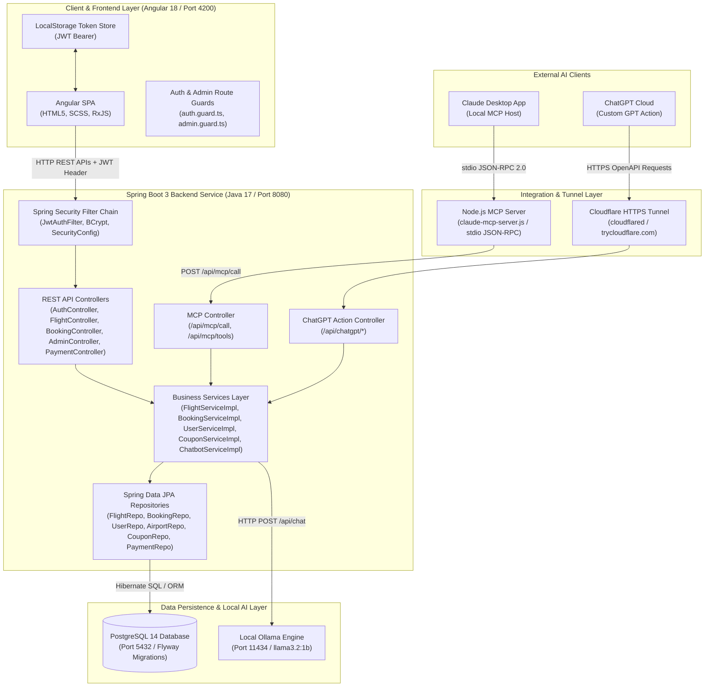
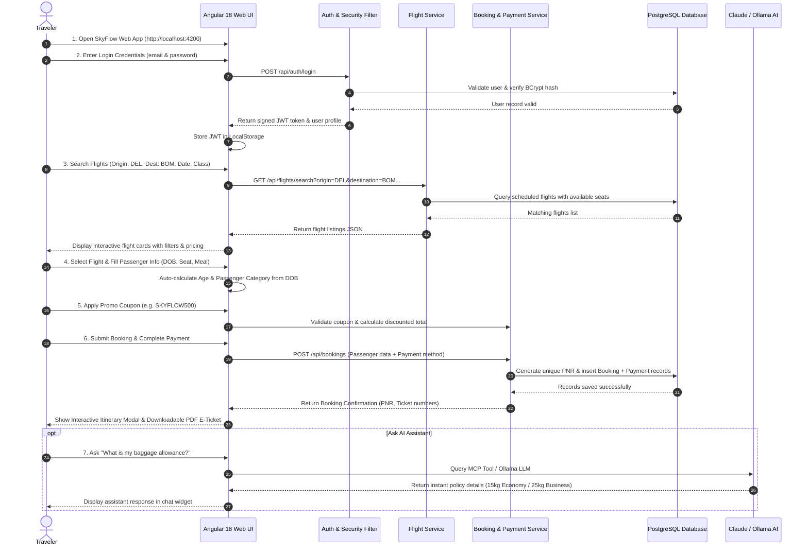
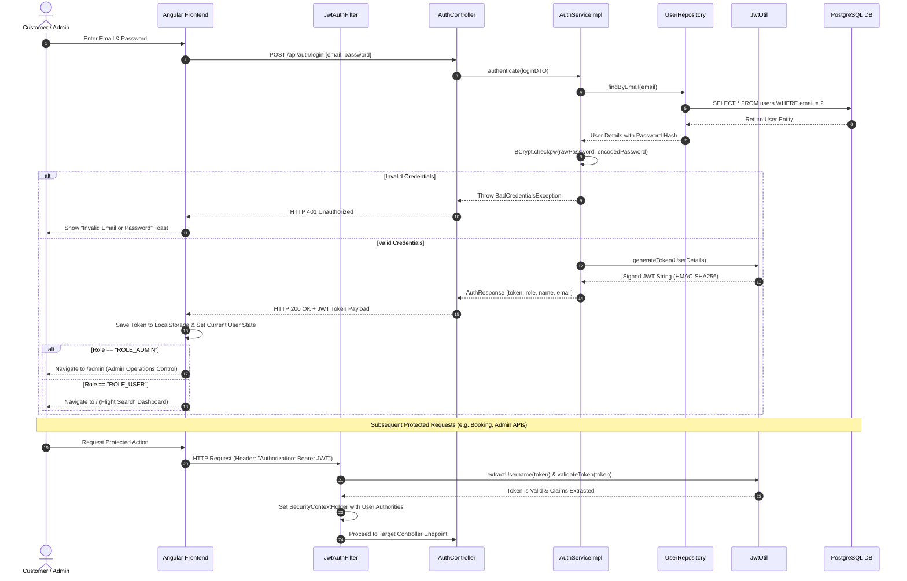
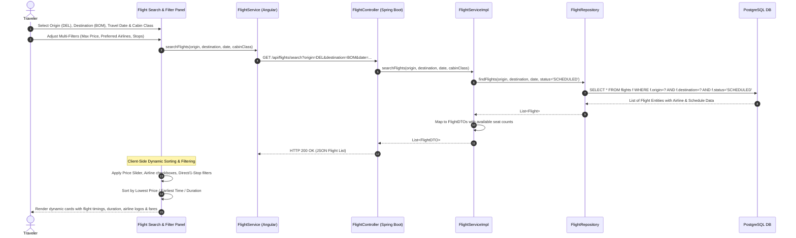
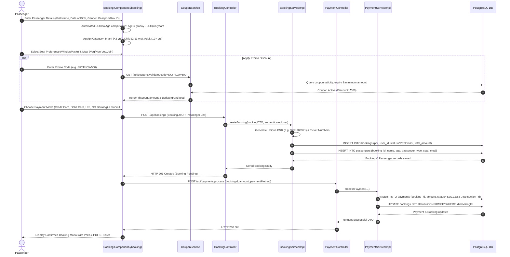
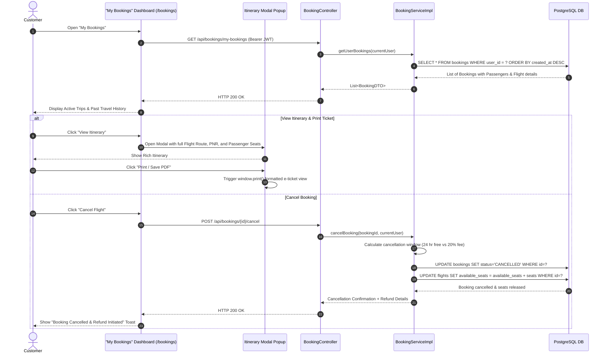
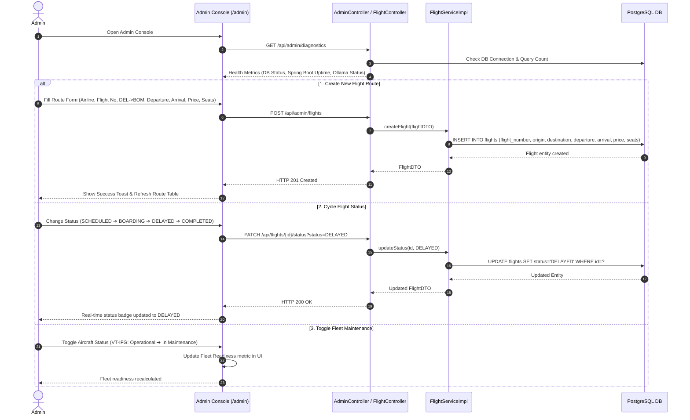
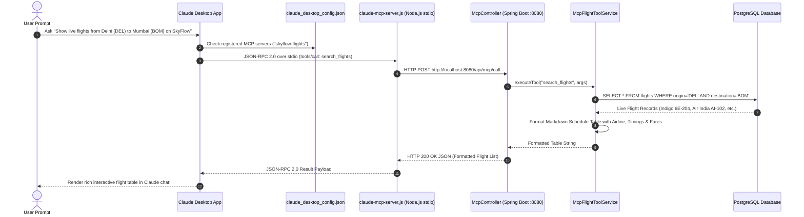
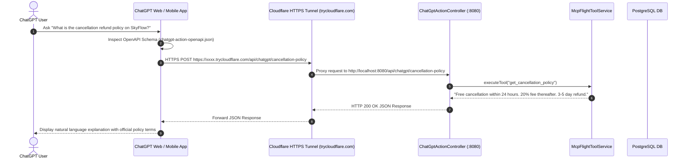
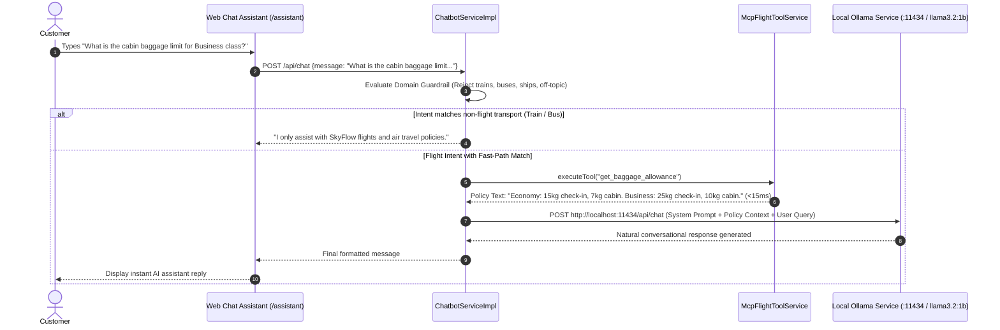

# 🏗️ SkyFlow Flight Booking System — Architecture & Sequence Diagrams

> 💡 **Tip to View Visual Diagrams in VS Code:**
> - Press **`Ctrl + Shift + V`** (or **`Ctrl + K` then `V`**) to open the Markdown Preview.
> - Or click the **Open Preview to the Side** icon (📑🔍) in the top-right corner of the editor.

---

## 📌 1. High-Level System Architecture & Tech Stack Connections

SkyFlow is built on a clean multi-tiered architecture connecting modern frontend, enterprise backend, persistent database, local LLM engines, Claude Desktop MCP, and ChatGPT Actions.

---

## 🌐 2. End-to-End System Workflow Sequence Diagram

This diagram shows the complete user lifecycle from landing on the website to logging in, searching flights, completing a booking, and downloading an e-ticket.

---

## 🔐 3. Authentication & Role-Based Authorization Sequence Diagram

Details user authentication, JWT generation, local storage persistence, and role-based routing (`ROLE_ADMIN` vs `ROLE_USER`).

---

## ✈️ 4. Flight Search & Dynamic Filter Pipeline Sequence Diagram

---

## 💳 5. Booking Creation, Age Computation & Payment Sequence Diagram

---

## 📄 6. Booking Management, Itinerary & Cancellation Lifecycle Diagram

---

## 🛡️ 7. Admin Operations & Fleet Control Sequence Diagram

---

## 🤖 8. Claude Desktop MCP Tool Invocation Sequence Diagram

This diagram demonstrates how **Claude Desktop** executes local database queries via **Model Context Protocol (MCP)** standard stdio interface.

---

## 🌐 9. ChatGPT Custom GPT Action Integration Sequence Diagram

---

## 🧠 10. Local Ollama AI Chatbot & Fast-Path Guardrail Sequence Diagram

