# SkyFlow Architecture & System Design

## 📋 Table of Contents
- [System Architecture](#system-architecture)
- [Data Flow Diagrams](#data-flow-diagrams)
- [Sequence Diagrams](#sequence-diagrams)
- [Database Schema](#database-schema)
- [MCP Integration Flow](#mcp-integration-flow)
- [Authentication Flow](#authentication-flow)

---

## 🏗️ System Architecture

### High-Level Architecture

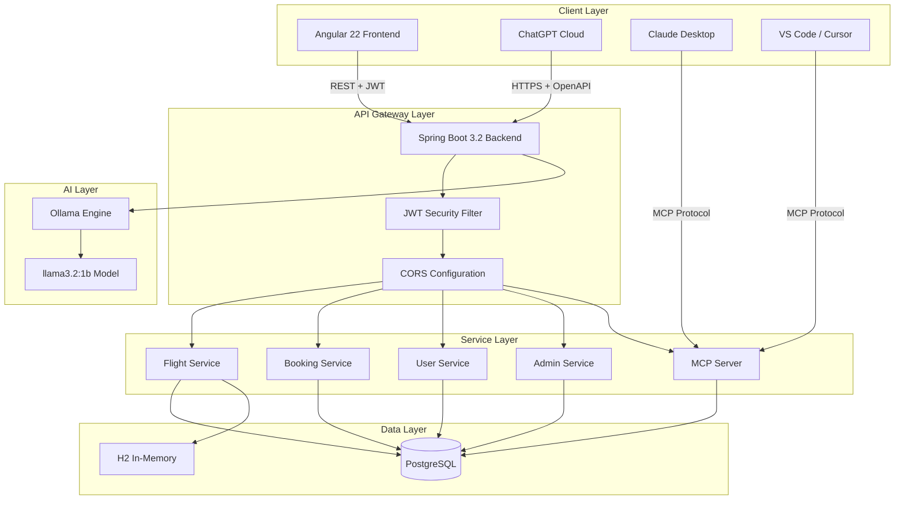
```mermaid
graph TB
    subgraph "Client Layer"
        A[Angular 22 Frontend]
        B[ChatGPT Cloud]
        C[Claude Desktop]
        D[VS Code / Cursor]
    end

    subgraph "API Gateway Layer"
        E[Spring Boot 3.2 Backend]
        F[JWT Security Filter]
        G[CORS Configuration]
    end

    subgraph "Service Layer"
        H[Flight Service]
        I[Booking Service]
        J[User Service]
        K[Admin Service]
        L[MCP Server]
    end

    subgraph "Data Layer"
        M[(PostgreSQL)]
        N[H2 In-Memory]
    end

    subgraph "AI Layer"
        O[Ollama Engine]
        P[llama3.2:1b Model]
    end

    A -->|REST + JWT| E
    B -->|HTTPS + OpenAPI| E
    C -->|MCP Protocol| L
    D -->|MCP Protocol| L
    E --> F
    F --> G
    G --> H
    G --> I
    G --> J
    G --> K
    G --> L
    H --> M
    I --> M
    J --> M
    K --> M
    L --> M
    H --> N
    E --> O
    O --> P
```

### Component Architecture

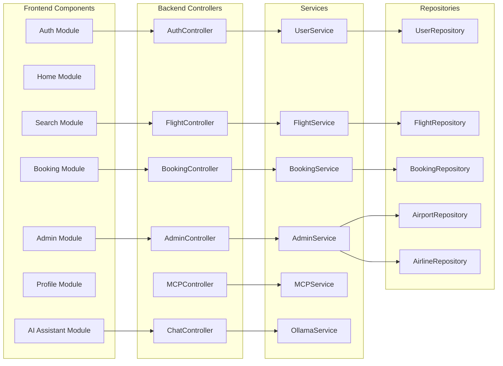
```mermaid
graph LR
    subgraph "Frontend Components"
        A1[Auth Module]
        A2[Home Module]
        A3[Search Module]
        A4[Booking Module]
        A5[Admin Module]
        A6[Profile Module]
        A7[AI Assistant Module]
    end

    subgraph "Backend Controllers"
        B1[AuthController]
        B2[FlightController]
        B3[BookingController]
        B4[AdminController]
        B5[MCPController]
        B6[ChatController]
    end

    subgraph "Services"
        C1[UserService]
        C2[FlightService]
        C3[BookingService]
        C4[AdminService]
        C5[MCPService]
        C6[OllamaService]
    end

    subgraph "Repositories"
        D1[UserRepository]
        D2[FlightRepository]
        D3[BookingRepository]
        D4[AirportRepository]
        D5[AirlineRepository]
    end

    A1 --> B1
    A3 --> B2
    A4 --> B3
    A5 --> B4
    A7 --> B6

    B1 --> C1
    B2 --> C2
    B3 --> C3
    B4 --> C4
    B5 --> C5
    B6 --> C6

    C1 --> D1
    C2 --> D2
    C3 --> D3
    C4 --> D4
    C4 --> D5
```

---

## 📊 Data Flow Diagrams

### User Authentication Flow

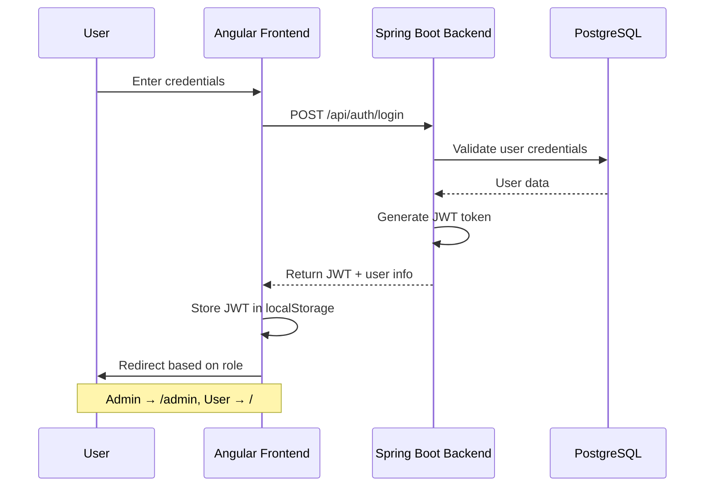
```mermaid
sequenceDiagram
    participant U as User
    participant FE as Angular Frontend
    participant BE as Spring Boot Backend
    participant DB as PostgreSQL

    U->>FE: Enter credentials
    FE->>BE: POST /api/auth/login
    BE->>DB: Validate user credentials
    DB-->>BE: User data
    BE->>BE: Generate JWT token
    BE-->>FE: Return JWT + user info
    FE->>FE: Store JWT in localStorage
    FE->>U: Redirect based on role
    Note over FE,U: Admin → /admin, User → /
```

### Flight Search Flow

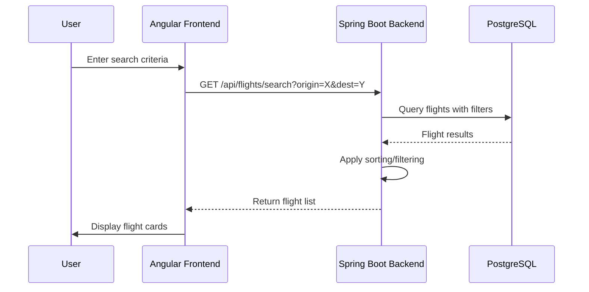
```mermaid
sequenceDiagram
    participant U as User
    participant FE as Angular Frontend
    participant BE as Spring Boot Backend
    participant DB as PostgreSQL

    U->>FE: Enter search criteria
    FE->>BE: GET /api/flights/search?origin=X&dest=Y
    BE->>DB: Query flights with filters
    DB-->>BE: Flight results
    BE->>BE: Apply sorting/filtering
    BE-->>FE: Return flight list
    FE->>U: Display flight cards
```

### Booking Flow

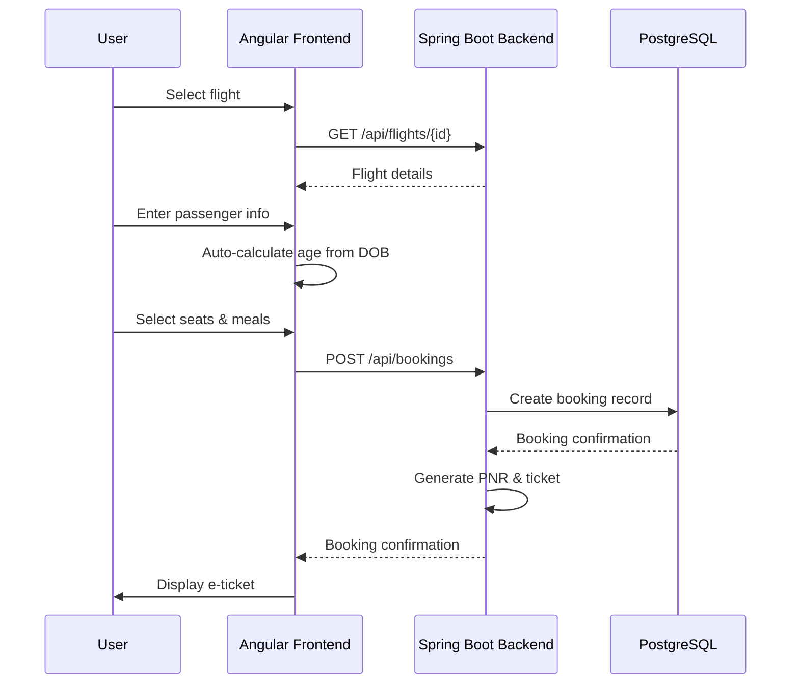
```mermaid
sequenceDiagram
    participant U as User
    participant FE as Angular Frontend
    participant BE as Spring Boot Backend
    participant DB as PostgreSQL

    U->>FE: Select flight
    FE->>BE: GET /api/flights/{id}
    BE-->>FE: Flight details
    U->>FE: Enter passenger info
    FE->>FE: Auto-calculate age from DOB
    U->>FE: Select seats & meals
    FE->>BE: POST /api/bookings
    BE->>DB: Create booking record
    DB-->>BE: Booking confirmation
    BE->>BE: Generate PNR & ticket
    BE-->>FE: Booking confirmation
    FE->>U: Display e-ticket
```

### MCP Tool Execution Flow

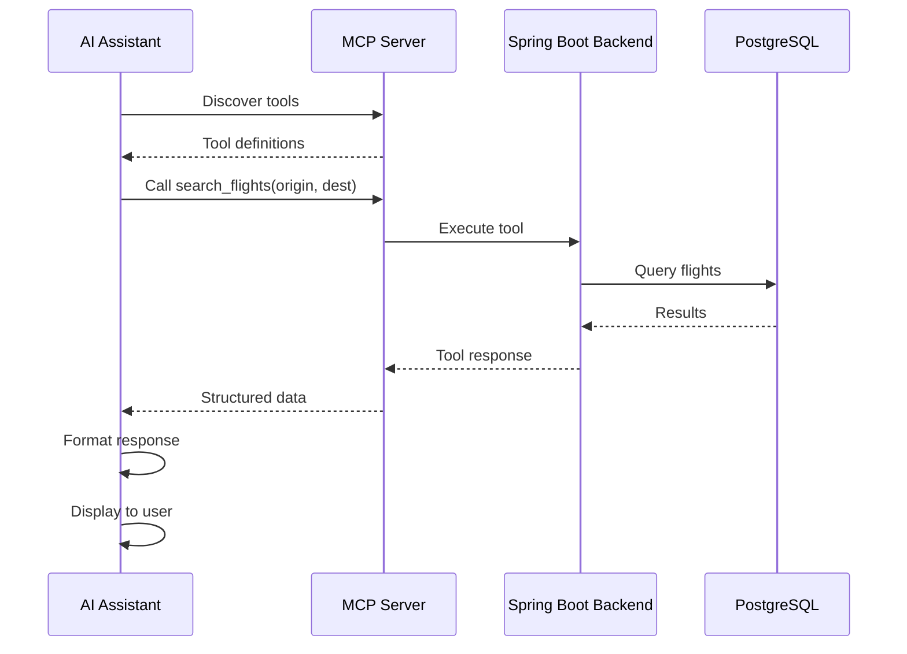
```mermaid
sequenceDiagram
    participant AI as AI Assistant
    participant MCP as MCP Server
    participant BE as Spring Boot Backend
    participant DB as PostgreSQL

    AI->>MCP: Discover tools
    MCP-->>AI: Tool definitions
    
    AI->>MCP: Call search_flights(origin, dest)
    MCP->>BE: Execute tool
    BE->>DB: Query flights
    DB-->>BE: Results
    BE-->>MCP: Tool response
    MCP-->>AI: Structured data
    AI->>AI: Format response
    AI->>AI: Display to user
```

### ChatGPT Plugin Flow

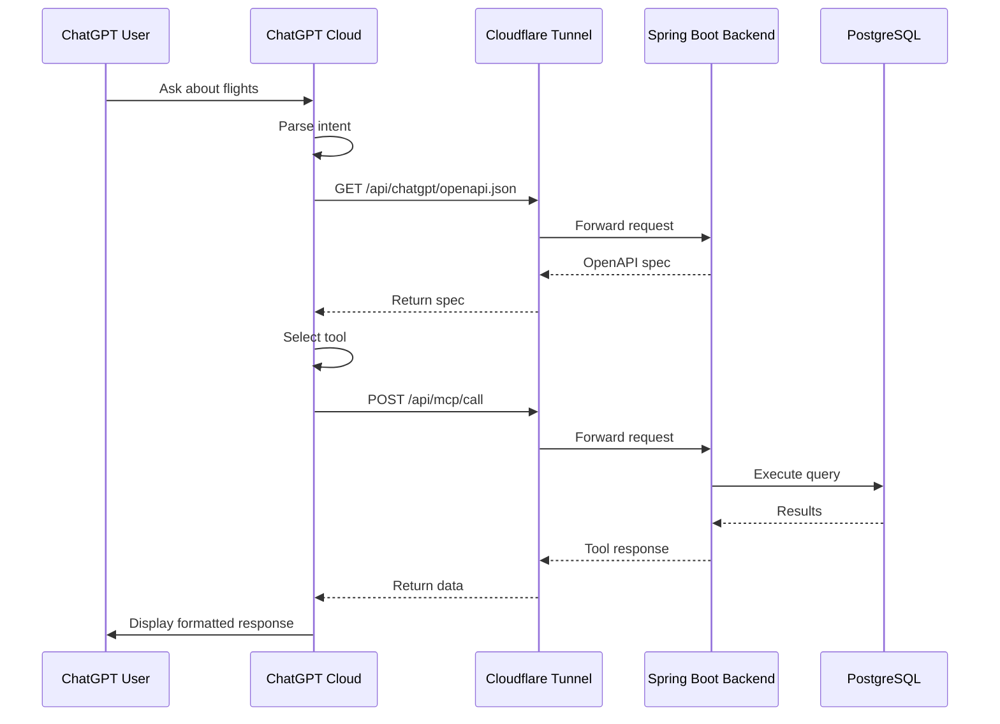
```mermaid
sequenceDiagram
    participant U as ChatGPT User
    participant CGPT as ChatGPT Cloud
    participant CF as Cloudflare Tunnel
    participant BE as Spring Boot Backend
    participant DB as PostgreSQL

    U->>CGPT: Ask about flights
    CGPT->>CGPT: Parse intent
    CGPT->>CF: GET /api/chatgpt/openapi.json
    CF->>BE: Forward request
    BE-->>CF: OpenAPI spec
    CF-->>CGPT: Return spec
    
    CGPT->>CGPT: Select tool
    CGPT->>CF: POST /api/mcp/call
    CF->>BE: Forward request
    BE->>DB: Execute query
    DB-->>BE: Results
    BE-->>CF: Tool response
    CF-->>CGPT: Return data
    CGPT->>U: Display formatted response
```

---

## 🔄 Sequence Diagrams

### Complete Booking Sequence

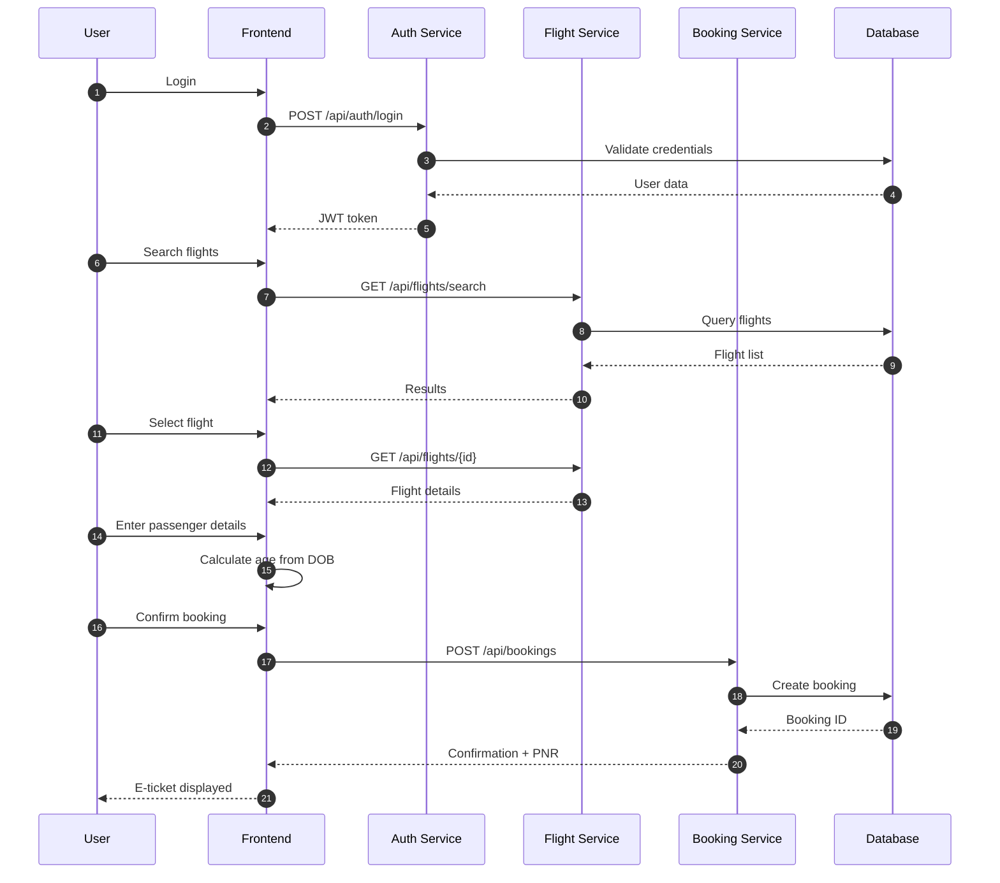
```mermaid
sequenceDiagram
    autonumber
    participant U as User
    participant FE as Frontend
    participant Auth as Auth Service
    participant Flight as Flight Service
    participant Booking as Booking Service
    participant DB as Database

    U->>FE: Login
    FE->>Auth: POST /api/auth/login
    Auth->>DB: Validate credentials
    DB-->>Auth: User data
    Auth-->>FE: JWT token
    
    U->>FE: Search flights
    FE->>Flight: GET /api/flights/search
    Flight->>DB: Query flights
    DB-->>Flight: Flight list
    Flight-->>FE: Results
    
    U->>FE: Select flight
    FE->>Flight: GET /api/flights/{id}
    Flight-->>FE: Flight details
    
    U->>FE: Enter passenger details
    FE->>FE: Calculate age from DOB
    
    U->>FE: Confirm booking
    FE->>Booking: POST /api/bookings
    Booking->>DB: Create booking
    DB-->>Booking: Booking ID
    Booking-->>FE: Confirmation + PNR
    FE-->>U: E-ticket displayed
```

### Admin Flight Management Sequence

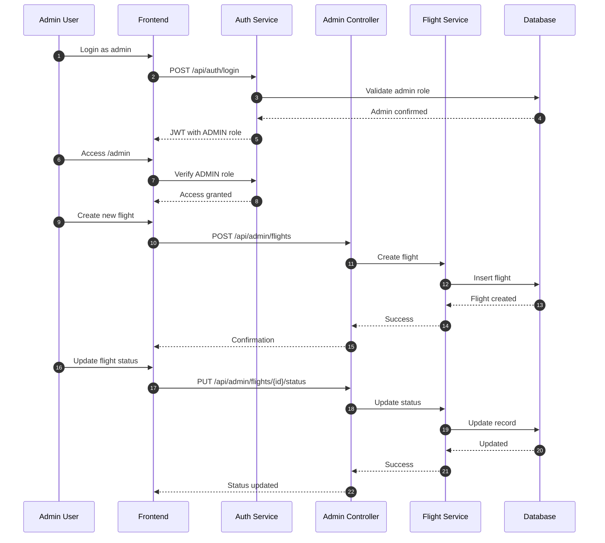
```mermaid
sequenceDiagram
    autonumber
    participant Admin as Admin User
    participant FE as Frontend
    participant Auth as Auth Service
    participant AdminCtrl as Admin Controller
    participant FlightSvc as Flight Service
    participant DB as Database

    Admin->>FE: Login as admin
    FE->>Auth: POST /api/auth/login
    Auth->>DB: Validate admin role
    DB-->>Auth: Admin confirmed
    Auth-->>FE: JWT with ADMIN role
    
    Admin->>FE: Access /admin
    FE->>Auth: Verify ADMIN role
    Auth-->>FE: Access granted
    
    Admin->>FE: Create new flight
    FE->>AdminCtrl: POST /api/admin/flights
    AdminCtrl->>FlightSvc: Create flight
    FlightSvc->>DB: Insert flight
    DB-->>FlightSvc: Flight created
    FlightSvc-->>AdminCtrl: Success
    AdminCtrl-->>FE: Confirmation
    
    Admin->>FE: Update flight status
    FE->>AdminCtrl: PUT /api/admin/flights/{id}/status
    AdminCtrl->>FlightSvc: Update status
    FlightSvc->>DB: Update record
    DB-->>FlightSvc: Updated
    FlightSvc-->>AdminCtrl: Success
    AdminCtrl-->>FE: Status updated
```

---

## 🗄️ Database Schema

### Entity Relationship Diagram

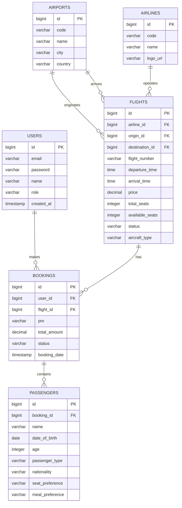
```mermaid
erDiagram
    USERS {
        bigint id PK
        varchar email
        varchar password
        varchar name
        varchar role
        timestamp created_at
    }
    
    AIRPORTS {
        bigint id PK
        varchar code
        varchar name
        varchar city
        varchar country
    }
    
    AIRLINES {
        bigint id PK
        varchar code
        varchar name
        varchar logo_url
    }
    
    FLIGHTS {
        bigint id PK
        bigint airline_id FK
        bigint origin_id FK
        bigint destination_id FK
        varchar flight_number
        time departure_time
        time arrival_time
        decimal price
        integer total_seats
        integer available_seats
        varchar status
        varchar aircraft_type
    }
    
    BOOKINGS {
        bigint id PK
        bigint user_id FK
        bigint flight_id FK
        varchar pnr
        decimal total_amount
        varchar status
        timestamp booking_date
    }
    
    PASSENGERS {
        bigint id PK
        bigint booking_id FK
        varchar name
        date date_of_birth
        integer age
        varchar passenger_type
        varchar nationality
        varchar seat_preference
        varchar meal_preference
    }

    USERS ||--o{ BOOKINGS : makes
    AIRPORTS ||--o{ FLIGHTS : originates
    AIRPORTS ||--o{ FLIGHTS : arrives
    AIRLINES ||--o{ FLIGHTS : operates
    FLIGHTS ||--o{ BOOKINGS : has
    BOOKINGS ||--o{ PASSENGERS : contains
```

### Database Tables

| Table | Description |
|-------|-------------|
| `users` | User accounts with roles (USER/ADMIN) |
| `airports` | 10 Indian airport hubs |
| `airlines` | 5 airline partners |
| `flights` | Flight schedules and availability |
| `bookings` | User reservations with PNR |
| `passengers` | Passenger details per booking |

---

## 🤖 MCP Integration Flow

### MCP Server Architecture

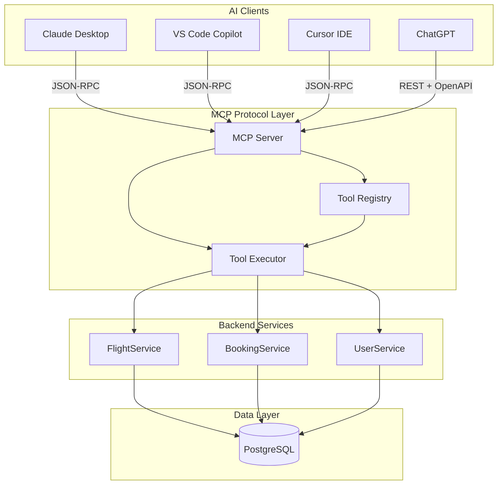
```mermaid
graph TB
    subgraph "AI Clients"
        A[Claude Desktop]
        B[VS Code Copilot]
        C[Cursor IDE]
        D[ChatGPT]
    end

    subgraph "MCP Protocol Layer"
        E[MCP Server]
        F[Tool Registry]
        G[Tool Executor]
    end

    subgraph "Backend Services"
        H[FlightService]
        I[BookingService]
        J[UserService]
    end

    subgraph "Data Layer"
        K[(PostgreSQL)]
    end

    A -->|JSON-RPC| E
    B -->|JSON-RPC| E
    C -->|JSON-RPC| E
    D -->|REST + OpenAPI| E
    
    E --> F
    E --> G
    F --> G
    
    G --> H
    G --> I
    G --> J
    
    H --> K
    I --> K
    J --> K
```

### MCP Tools Specification

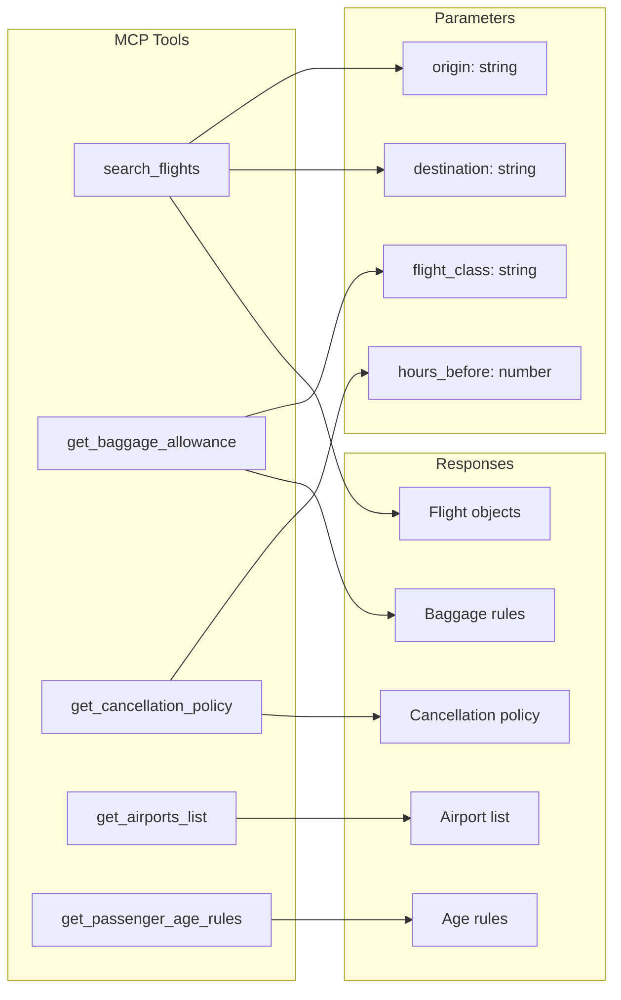
```mermaid
graph LR
    subgraph "MCP Tools"
        A[search_flights]
        B[get_baggage_allowance]
        C[get_cancellation_policy]
        D[get_airports_list]
        E[get_passenger_age_rules]
    end

    subgraph "Parameters"
        A1[origin: string]
        A2[destination: string]
        B1[flight_class: string]
        C1[hours_before: number]
    end

    subgraph "Responses"
        R1[Flight objects]
        R2[Baggage rules]
        R3[Cancellation policy]
        R4[Airport list]
        R5[Age rules]
    end

    A --> A1
    A --> A2
    B --> B1
    C --> C1
    
    A --> R1
    B --> R2
    C --> R3
    D --> R4
    E --> R5
```

---

## 🔐 Authentication Flow

### JWT Token Flow

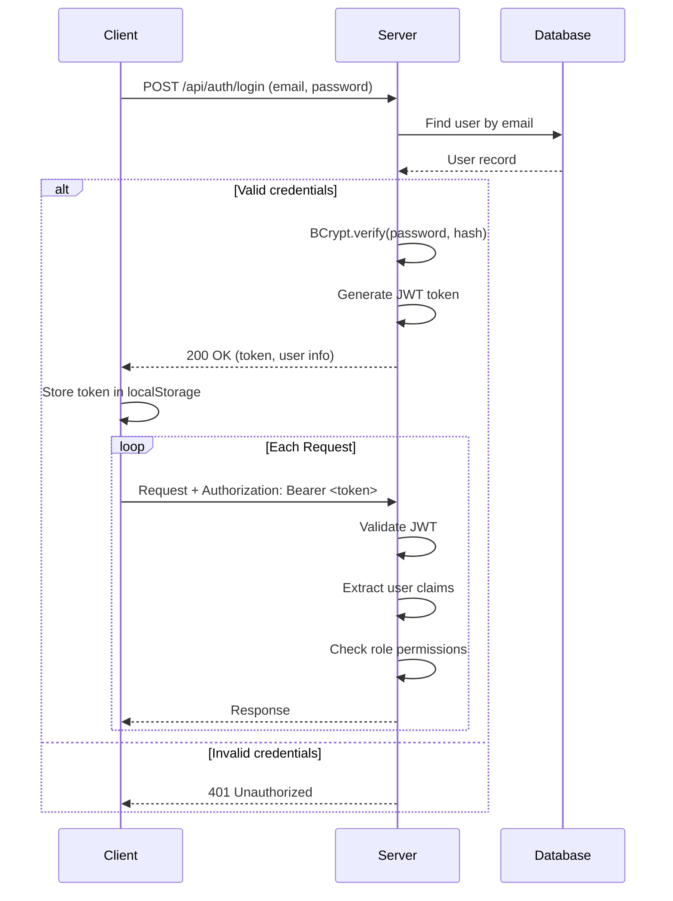
```mermaid
sequenceDiagram
    participant C as Client
    participant S as Server
    participant DB as Database

    C->>S: POST /api/auth/login (email, password)
    S->>DB: Find user by email
    DB-->>S: User record
    
    alt Valid credentials
        S->>S: BCrypt.verify(password, hash)
        S->>S: Generate JWT token
        S-->>C: 200 OK (token, user info)
        C->>C: Store token in localStorage
        
        loop Each Request
            C->>S: Request + Authorization: Bearer <token>
            S->>S: Validate JWT
            S->>S: Extract user claims
            S->>S: Check role permissions
            S-->>C: Response
        end
    else Invalid credentials
        S-->>C: 401 Unauthorized
    end
```

### Role-Based Access Control

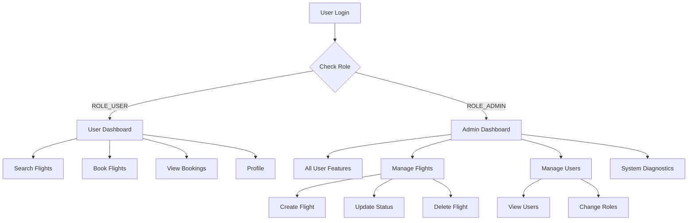
```mermaid
graph TD
    A[User Login] --> B{Check Role}
    B -->|ROLE_USER| C[User Dashboard]
    B -->|ROLE_ADMIN| D[Admin Dashboard]
    
    C --> C1[Search Flights]
    C --> C2[Book Flights]
    C --> C3[View Bookings]
    C --> C4[Profile]
    
    D --> D1[All User Features]
    D --> D2[Manage Flights]
    D --> D3[Manage Users]
    D --> D4[System Diagnostics]
    
    D2 --> D21[Create Flight]
    D2 --> D22[Update Status]
    D2 --> D23[Delete Flight]
    
    D3 --> D31[View Users]
    D3 --> D32[Change Roles]
```

---

## 🔌 API Integration Patterns

### REST API Structure

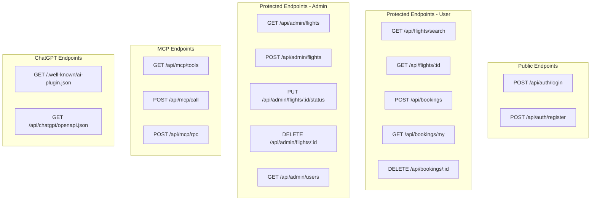
```mermaid
graph TB
    subgraph "Public Endpoints"
        A1[POST /api/auth/login]
        A2[POST /api/auth/register]
    end

    subgraph "Protected Endpoints - User"
        B1[GET /api/flights/search]
        B2[GET /api/flights/:id]
        B3[POST /api/bookings]
        B4[GET /api/bookings/my]
        B5[DELETE /api/bookings/:id]
    end

    subgraph "Protected Endpoints - Admin"
        C1[GET /api/admin/flights]
        C2[POST /api/admin/flights]
        C3[PUT /api/admin/flights/:id/status]
        C4[DELETE /api/admin/flights/:id]
        C5[GET /api/admin/users]
    end

    subgraph "MCP Endpoints"
        D1[GET /api/mcp/tools]
        D2[POST /api/mcp/call]
        D3[POST /api/mcp/rpc]
    end

    subgraph "ChatGPT Endpoints"
        E1[GET /.well-known/ai-plugin.json]
        E2[GET /api/chatgpt/openapi.json]
    end
```

### Error Handling Flow

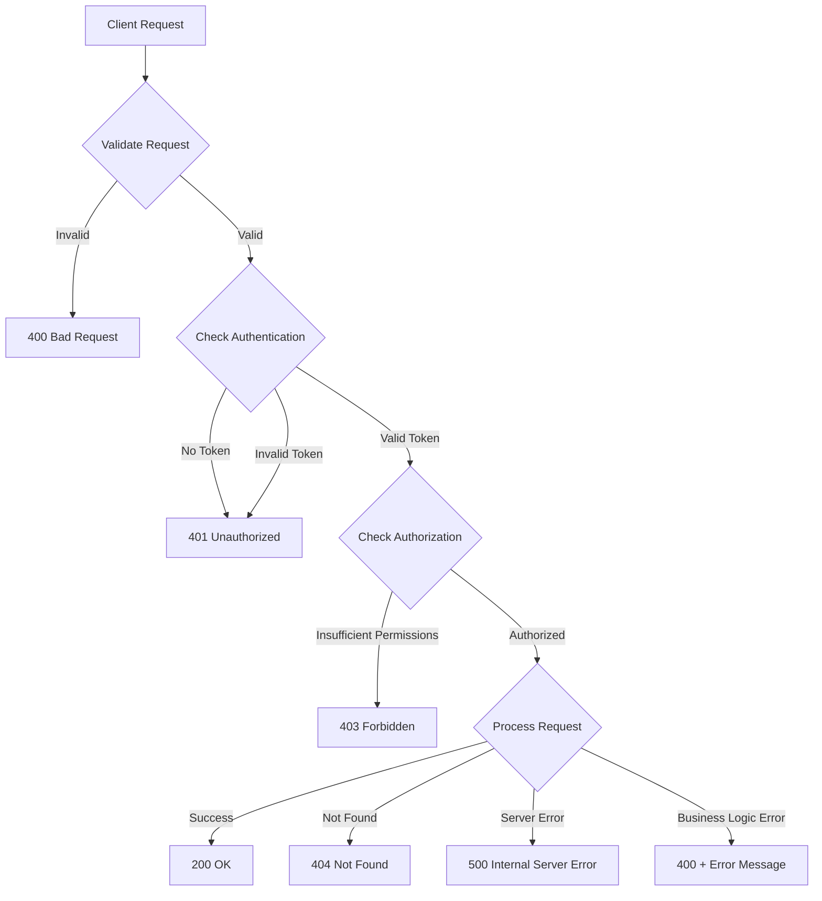
```mermaid
flowchart TD
    A[Client Request] --> B{Validate Request}
    B -->|Invalid| C[400 Bad Request]
    B -->|Valid| D{Check Authentication}
    D -->|No Token| E[401 Unauthorized]
    D -->|Invalid Token| E
    D -->|Valid Token| F{Check Authorization}
    F -->|Insufficient Permissions| G[403 Forbidden]
    F -->|Authorized| H{Process Request}
    H -->|Success| I[200 OK]
    H -->|Not Found| J[404 Not Found]
    H -->|Server Error| K[500 Internal Server Error]
    H -->|Business Logic Error| L[400 + Error Message]
```

---

## 📈 Performance & Scalability

### Request Processing Pipeline

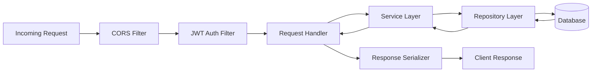
```mermaid
graph LR
    A[Incoming Request] --> B[CORS Filter]
    B --> C[JWT Auth Filter]
    C --> D[Request Handler]
    D --> E[Service Layer]
    E --> F[Repository Layer]
    F --> G[(Database)]
    G --> F
    F --> E
    E --> D
    D --> H[Response Serializer]
    H --> I[Client Response]
```

### Caching Strategy

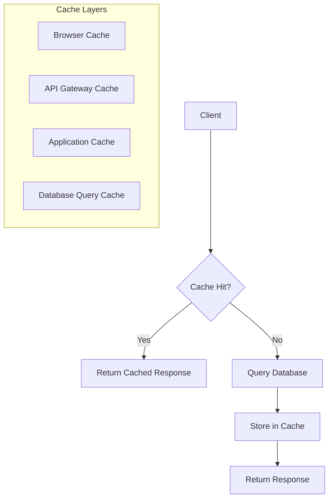
```mermaid
graph TB
    A[Client] --> B{Cache Hit?}
    B -->|Yes| C[Return Cached Response]
    B -->|No| D[Query Database]
    D --> E[Store in Cache]
    E --> F[Return Response]
    
    subgraph "Cache Layers"
        G[Browser Cache]
        H[API Gateway Cache]
        I[Application Cache]
        J[Database Query Cache]
    end
```

---

## 🔧 Deployment Architecture

### Development Environment

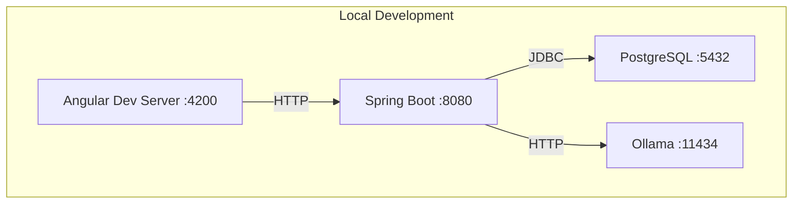
```mermaid
graph TB
    subgraph "Local Development"
        A[Angular Dev Server :4200]
        B[Spring Boot :8080]
        C[PostgreSQL :5432]
        D[Ollama :11434]
    end

    A -->|HTTP| B
    B -->|JDBC| C
    B -->|HTTP| D
```

### Production Environment

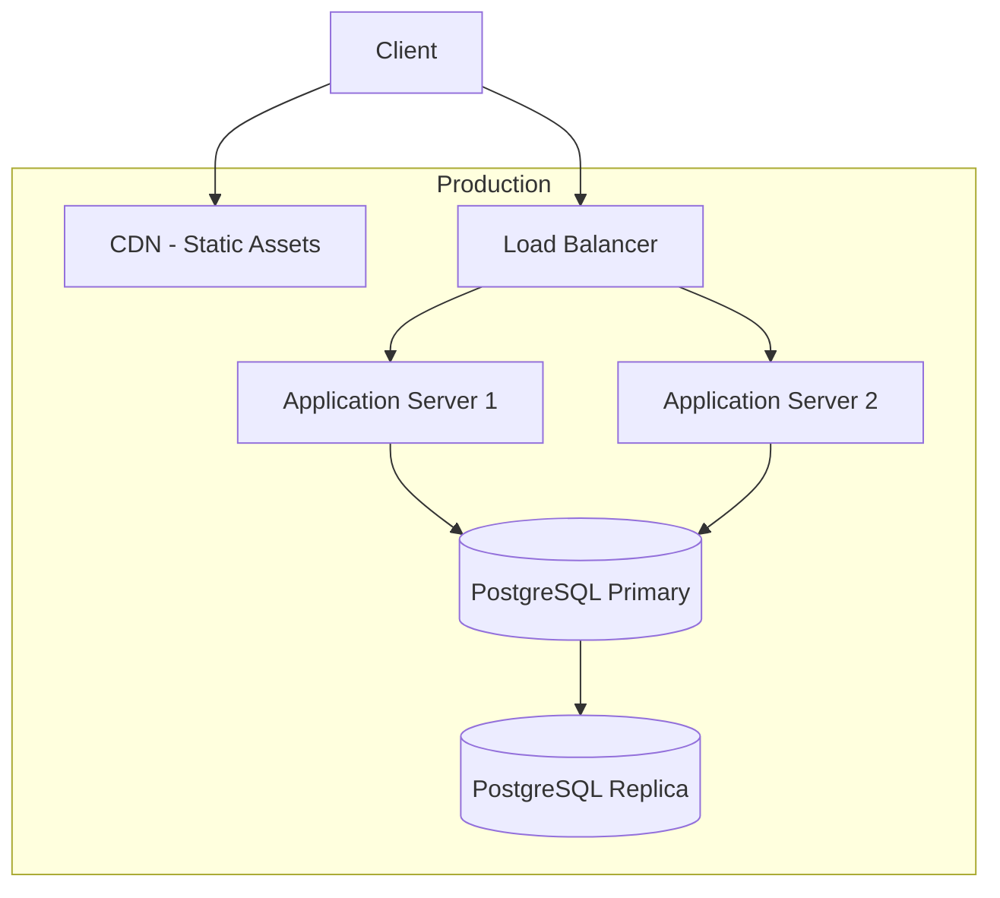
```mermaid
graph TB
    subgraph "Production"
        A[CDN - Static Assets]
        B[Load Balancer]
        C[Application Server 1]
        D[Application Server 2]
        E[(PostgreSQL Primary)]
        F[(PostgreSQL Replica)]
    end

    Client --> A
    Client --> B
    B --> C
    B --> D
    C --> E
    D --> E
    E --> F
```

---

## 📚 Documentation Index

- [PROJECT_OVERVIEW.md](./PROJECT_OVERVIEW.md) - Features and setup guide
- [ARCHITECTURE.md](./ARCHITECTURE.md) - This document
- [HOW_TO_RUN.md](../HOW_TO_RUN.md) - Detailed setup instructions
- [MCP README](../mcp/README.md) - MCP server documentation

---

*Last Updated: August 2026*
