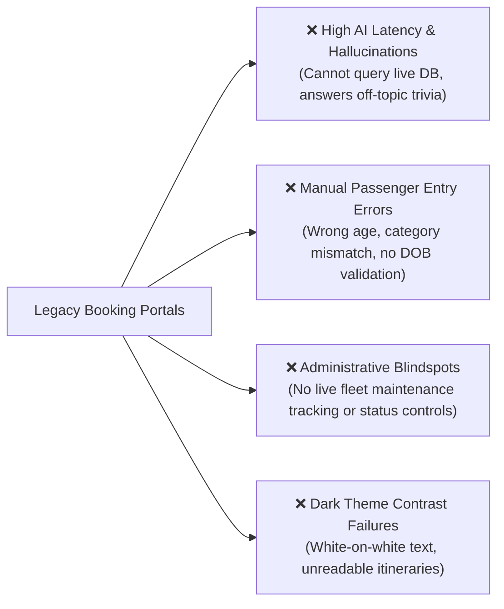
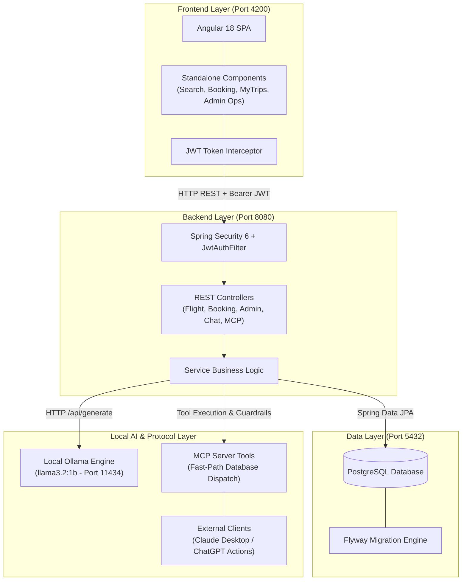
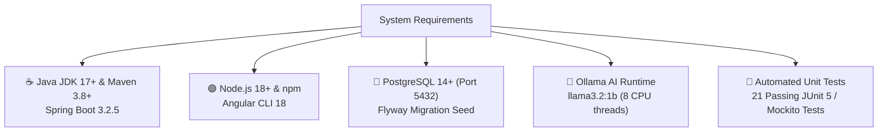
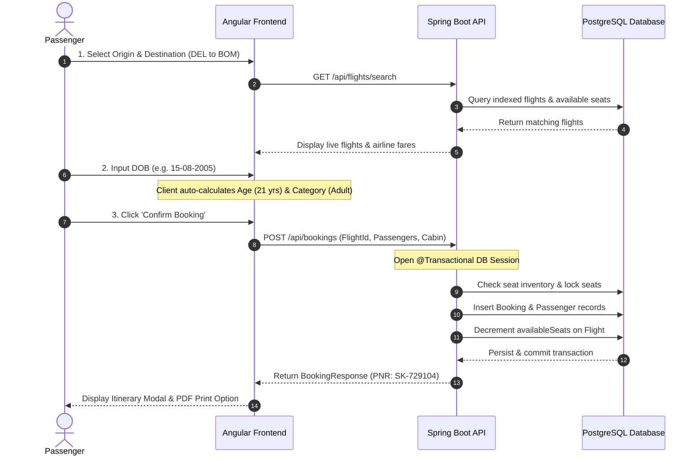
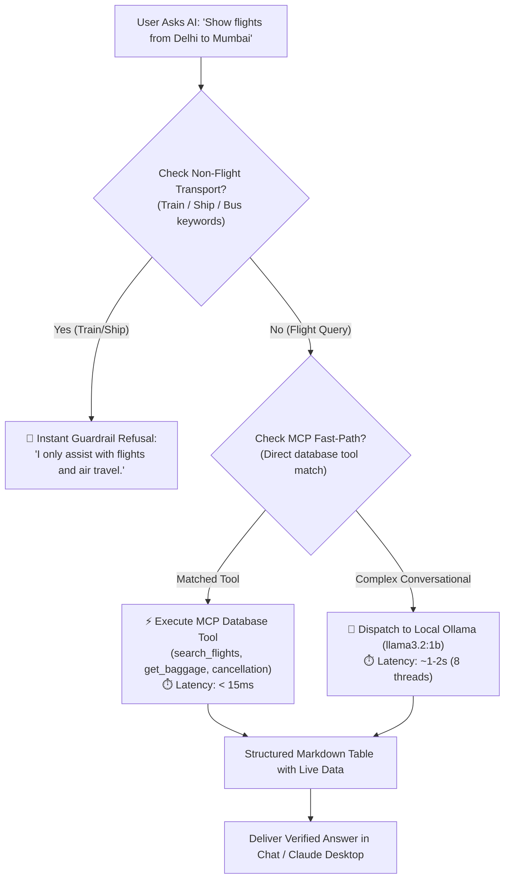
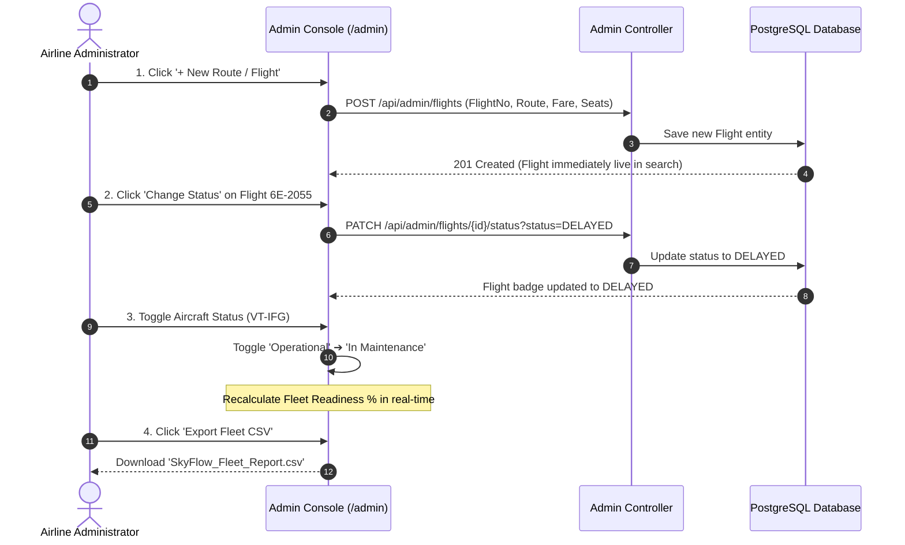
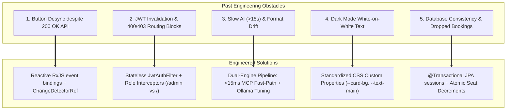
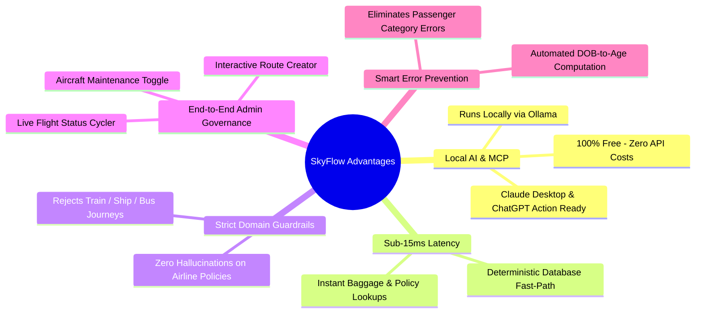
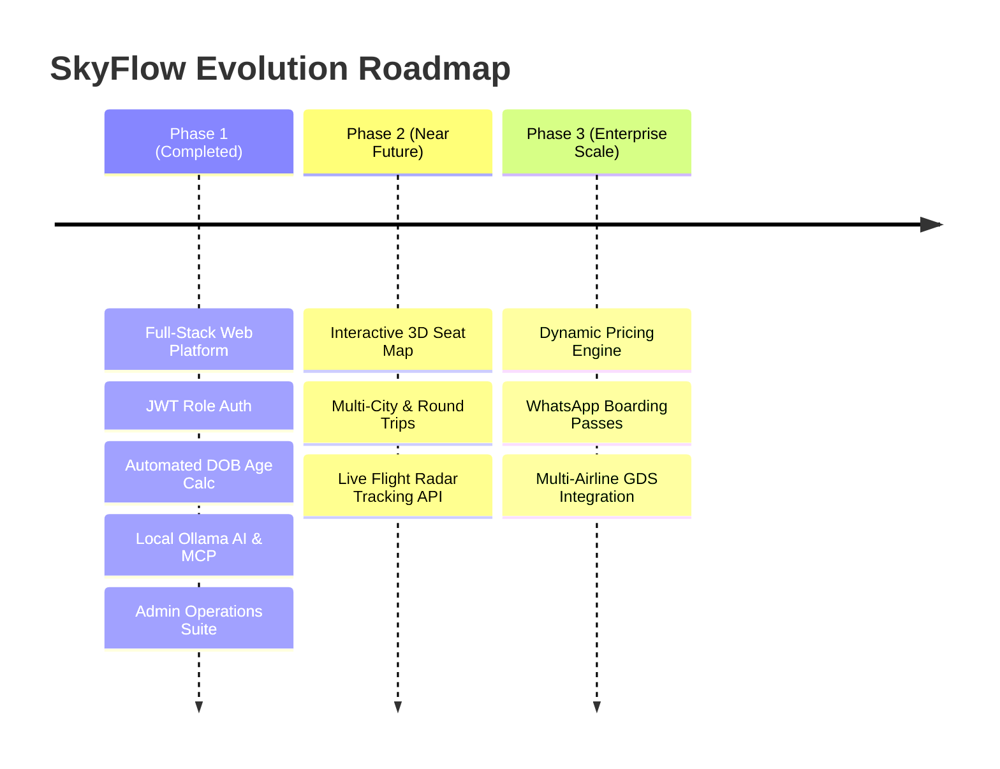

# 🛫 SkyFlow Presentation Slide Deck (With Flowcharts & Sequence Diagrams)

---

## 📽️ SLIDE 1: Title Slide

### **SkyFlow — Next-Gen Flight Booking & AI Operations Platform**
*Enterprise Air Travel Reservation Platform with Integrated Local AI & Model Context Protocol (MCP)*

- **Presenter**: Vaishnavi & Team
- **Stack**: Angular 18 | Spring Boot 3 | PostgreSQL | Ollama (`llama3.2:1b`) | MCP
- **Key Highlights**:
  - ⚡ Sub-15ms MCP Database Tool Dispatch
  - 🛡️ Strict Non-Flight Transport Guardrails (Train / Ship / Bus Refusal)
  - ⚙️ Full-Featured Admin Control Center & Fleet Manager
  - 🔒 Stateless Role-Based JWT Security

---

## 📽️ SLIDE 2: Problem Statement

### **Current Flaws in Legacy Airline Booking Systems**

- **Fragmented User Experience**: Inaccurate manual age entry and poor mobile/dark-mode contrast.
- **Disconnected Customer Support**: Traditional chatbots cannot verify real flight seats or refund policies.
- **Administrative Complexity**: Operators lack unified real-time control over dynamic flight scheduling and fleet readiness.
- **Security & Role Gaps**: Lack of granular separation between customer bookings and administrative operations.

---

## 📽️ SLIDE 3: System Architecture & Data Flow

### **Micro-Modular Enterprise Architecture**

---

## 📽️ SLIDE 4: System Requirements & Specifications

### **Prerequisites & Runtime Specs**

- **Default System Accounts**:
  - 🛡️ **Admin**: `admin@skyflow.com` / `Admin@123` (Redirects to `/admin`)
  - 👤 **Passenger**: `priya@example.com` / `Admin@123` (Redirects to Search `/`)

---

## 📽️ SLIDE 5: Core Features & End-to-End Workflows

### **1. Passenger Booking & PNR Generation Sequence**

---

### **2. AI Assistant & Model Context Protocol (MCP) Workflow**

---

### **3. Admin Operations & Flight Lifecycle**

---

## 📽️ SLIDE 6: Engineering Challenges Faced & Solutions

---

## 📽️ SLIDE 7: Uniqueness & Key Differentiators

---

## 📽️ SLIDE 8: Conclusion & Future Scope

- **Project Summary**: SkyFlow successfully delivers an enterprise-grade, high-performance, and intelligent flight booking ecosystem combining robust web engineering with local AI and MCP tool integration.
- **Q&A**: Open floor for questions and live system demonstration.
